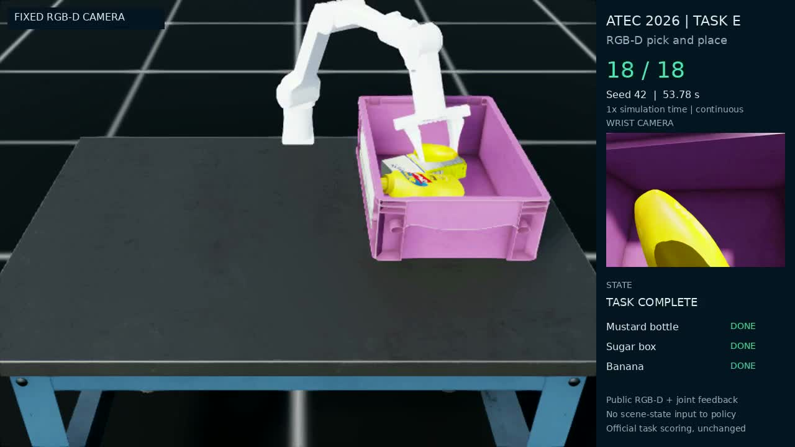

# ATEC Task E：RGB-D 三物体抓取与入篮

ATEC 项目统一入口：[Task A / Task E 工作与复习总览](docs/ATEC_PROJECTS.md) · [D1+G2 Task A 通关及强化学习复习](docs/TASKA_D1G2.md)。Task A 的模型和完整复现资料在关联私有仓库，本仓库公开结果摘要与方法说明。

一台固定在桌边的 Piper 机械臂，依次把芥末瓶、糖盒和香蕉放入篮中。策略从 RGB-D 图像估计夹持点，用运动学规划关节路径，再根据关节位置、夹爪开度和公开得分推进抓放过程。

当前 v3 独立包在本机 **seed 42 和 seed 0 均得到 18/18 分**。seed 42 用时 **53.78 秒**，相比满分基线缩短 **13.03%**。这是已知机器人、相机和物体配置下的几何控制方案，成绩来自本地比赛环境。

[](media/task_e_fast_seed42_color.mp4)

[彩色演示视频](media/task_e_fast_seed42_color.mp4) · [原始录像](media/task_e_fast_seed42_original.mp4) · [视频与代码包下载](https://github.com/LYHrmer/atec-taske-rgbd-manipulation/releases/tag/fast-smooth-18)

## 从哪里开始读

第一次接触项目，建议从 [项目导读](docs/LEARNING_GUIDE.md) 开始。它从视频中的具体动作讲起，再把感知、运动学和状态机连到一起。

| 想弄清楚的事情 | 对应资料 |
| --- | --- |
| 整个任务怎么完成，各模块怎样配合 | [项目导读](docs/LEARNING_GUIDE.md) |
| 像素怎样变成夹持点，IK 又在求什么 | [算法原理与公式](docs/ALGORITHM.md) |
| 一次 `predicts` 调用会经过哪些代码 | [代码导读](docs/CODE_WALKTHROUGH.md) |
| 不开仿真，先自己算一遍关键步骤 | [五个动手练习](docs/HANDS_ON.md) |
| 为什么能省下 8.06 秒，动作指标怎样比较 | [优化记录](docs/OPTIMIZATION.md) |
| 怎样讲项目，以及如何检查自己是否读懂 | [面试讲解](docs/INTERVIEW.md) · [自测题](docs/SELF_CHECK.md) |

## 实测结果

| 运行版本 | 种子 | 得分 | 仿真时间 | 记录 |
| --- | ---: | ---: | ---: | --- |
| v3 独立包 | 42 | **18/18** | **53.78 s** | [结果与源码哈希](results/fast_seed42_package.json) |
| v3 独立包 | 0 | **18/18** | **62.36 s** | [结果与源码哈希](results/fast_seed0_package.json) |
| v2 满分基线 | 42 | 18/18 | 61.84 s | [基线结果](results/seed42_video.json) |

视频对应 v3 的 seed 42 源版本，打包时只规范化了导入路径；独立包随后复现相同步数和分数。详细对应关系见 [录像源码记录](results/fast_seed42_source.json)，旧版代码与视频保留在 [baseline-18](https://github.com/LYHrmer/atec-taske-rgbd-manipulation/releases/tag/baseline-18)。

加速主要来自满足反馈条件后结束等待，以及减少糖盒回撤时的多余转腕。全程腕关节行程减少 14.39%，但差分加速度 RMS 增加 4.36%；[逐步数据与对比报告](results/motion_comparison/analysis.md) 同时保留这些变化。有限种子的结果还不足以估计随机场景成功率；另一个远端香蕉实验分支在 seed 5 得到 15/18，失败记录见 [far5_experiment.json](results/far5_experiment.json)。

官方入篮计分可能早于最后一次松爪。seed 42 另外观察了 3 秒：夹爪最终张开到约 70 mm，三个物体在最后 1 秒持续留在篮区。[释放报告](results/fast42_release/post_terminal_release.json) 和 [最终截图](media/fast_release_final.png) 单独保存，额外诊断时间不计入 53.78 秒。

## 几个决定成败的细节

瓶子的夹持点在瓶颈，瓶身悬在下方，所以需要先抬高，再越过篮沿。香蕉的弯曲外形、碰撞几何和手指厚度共同影响接触位置，刚离桌时采用小幅姿态变化。糖盒则需要检查中间 IK 路径，避免端点可达、手腕却在中途绕行。

当前决策使用固定外部 RGB-D；视频中的腕部相机用于观察和诊断。机器人尺寸、标定和固定桌篮配置来自公开任务定义，随机物体位置由图像估计。运行策略不读取真实物体位姿，也不需要训练权重 `policy.pt`。

## 本地复现

先按 [ATEC 官方项目](https://github.com/atecup/ATEC2026_Simulation_Challenge) 配置 Isaac Lab 与比赛资产。策略依赖 NumPy/SciPy，录像评测另需官方环境、Pillow、PyTorch 和 FFmpeg。官方机器人与物体资产不在本仓库中。

本机已验证环境：Ubuntu、Python 3.10.20、Isaac Sim 4.5、Isaac Lab 2.3.2、PyTorch 2.7.0+cu128、RTX 5060 Laptop。评测工具包含该环境所需的相机接口兼容处理。

```bash
export ATEC_TASK_ROOT=/path/to/ATEC2026_Simulation_Challenge
export ATEC_PYTHON=/path/to/isaaclab/environment/bin/python

"$ATEC_PYTHON" -m pip install -r requirements.txt
bash scripts/evaluate.sh --check
bash scripts/evaluate.sh --solution solution.py --headless --seed 42 \
  --max_steps 6000 --output runs/seed42 --video runs/seed42.mp4
```

每次使用新的输出目录。评测会保存源码快照、得分、逐步遥测和录像；MP4 编码封装完成后才显示最终文件。视频按 1 倍仿真时间连续展示，结尾定格 2 秒。彩色版只调整饱和度、对比度与编码，处理参数和文件哈希见 [视频来源记录](media/provenance.json)。

不启动仿真，可以先跑学习算例和已有的 20 项检查：

```bash
PYTHONNOUSERSITE=1 "$ATEC_PYTHON" tools/task_e/learn_geometry.py
PYTHONNOUSERSITE=1 "$ATEC_PYTHON" -m unittest discover -s tests -p 'test_*.py' -v
```

官方入口是 [solution.py](solution.py) 中的 `AlgSolution.predicts(obs, current_score)`，返回八维 `action` 和布尔 `giveup`。运行时需要根目录的七个策略 Python 文件；继承关系、调用顺序和动作尺度见 [代码导读](docs/CODE_WALKTHROUGH.md)。

## 许可与来源

代码采用 MIT 许可，保留 ATEC 版权与来源说明。任务、Piper/YCB 等资产由各自项目提供。详见 [LICENSE](LICENSE) 与 [ATTRIBUTIONS.md](ATTRIBUTIONS.md)。
