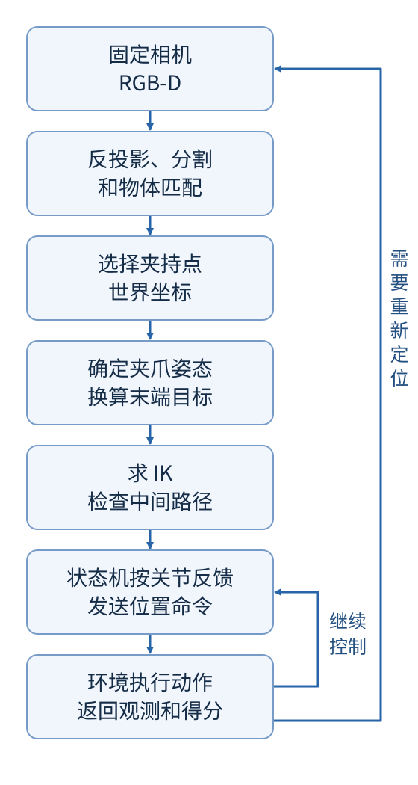

# 从一段抓取视频读懂这个项目

[仓库首页](../README.md) · [Task E 总览与运行](TASK_E.md) · [Task E 学习路线](LEARNING_GUIDE.md) · [跨任务学习路线](ATEC_PROJECTS.md)

桌上有一瓶芥末、一盒糖和一根香蕉。机械臂要依次把它们夹起来，送进旁边的篮子。看起来是一套重复动作，实际要接连回答三个问题：物体在哪里，夹爪应该怎样靠近，动作执行后到底发生了什么。

这个项目用固定相机的 RGB-D 图像回答第一个问题，用机器人运动学回答第二个问题，再用关节观测、夹爪开度和公开得分检查第三个问题。三个环节串起来，才构成一次完整抓放。

## 先看机械臂在做什么

打开 [53.78 秒演示视频](../media/task_e_fast_seed42_color.mp4)。第一遍看完整过程，第二遍留意三个地方：瓶子先升到较高位置才横移；香蕉刚离桌时姿态变化很小；糖盒放下后，夹爪向上退出篮区，再回到观察位置。

这三个细节都有原因。瓶身悬在夹持点下方，夹爪自己高过篮沿，瓶底仍可能撞上去。香蕉靠近端部时容易在手指间转动，抬升初段的姿态变化需要收敛一些。糖盒已经松开，回撤时再绕一大圈手腕只会浪费时间。后面的算法和优化都可以从这些画面找到对应动作。

录像右侧有两路相机画面，但当前抓取决策使用固定外部相机。腕部相机画面用于观察过程。视频里的 18 分来自本机比赛环境：三个物体首次抓起各 3 分，首次入篮各 3 分。

## 一次抓取怎样穿过整个程序

以瓶子为例，相机先看到瓶盖和瓶身的表面。程序把有效深度变成三维点，在工作区内找出形状符合瓶子的点簇，再用顶部点云修正瓶颈夹持点。这个位置随当前图像变化，不是写死的出生坐标。

随后，程序选择夹爪的朝向。夹持点位于两根手指之间，而运动学计算的末端原点在夹爪座上，两者相差一段距离。先换算出夹爪座应该到达的位置，才能求出六个臂关节的目标角度。

机械臂不会一次跳到这个目标。程序生成中间路径点，每个控制周期读取实际关节位置，只向当前路径点推进一小段。接近、闭爪、抬升、搬运和放置由不同状态管理。关节到了目标位置，并不意味着物体已经抓住，所以抬升后还要检查夹宽和得分。

读代码时，可以沿着这条线找四个入口：`estimate_grasp_contacts` 选夹持点，`solve_ik` 求关节解，`_motion_command` 跟踪路径，`predicts` 组织整个过程。[代码导读](CODE_WALKTHROUGH.md) 会把它们连到具体文件。

## 先分清几个容易混淆的量

| 名称 | 在本项目中的含义 |
| --- | --- |
| 位置 | 一个三维点，单位是米，例如瓶颈夹持点 |
| 姿态 | 一个坐标系的朝向；位置和姿态合起来称为位姿 |
| 世界坐标系 | 描述桌子、篮子、相机和机械臂的共同参照系 |
| 相机内参 | 把像素位置与相机中的观察方向联系起来 |
| 相机外参 | 把相机坐标中的点变到世界坐标 |
| FK，正运动学 | 给定关节角，计算末端在哪里、朝向哪里 |
| IK，逆运动学 | 给定末端目标，反求一组关节角；可能有多解或无解 |
| 路径点 | 到终点前要经过的中间目标，不是每帧实测位置 |
| 状态机 | 保存当前动作阶段，并根据反馈决定何时进入下一阶段 |
| seed，随机种子 | 固定一次随机场景生成过程，便于重复比较 |

机器人共有八个受控关节：前六个是转动关节，用弧度表示；后两个是直线夹爪关节，用米表示。因此，讨论“机械臂总转动量”时，只统计前六个关节，不能把八维数据直接相加。

`action` 也不是速度。环境把它换算成带默认姿态偏置的关节位置目标。这个区别会影响动作限幅、跟踪误差和速度统计，值得在读优化结果前先弄清楚。

## 按这个顺序读，不必一次记住所有参数

1. **读 [算法原理](ALGORITHM.md)。** 先能画出相机、世界和夹爪三个坐标系，再自己解释夹持点为什么不能直接送进 IK。
2. **读 [代码导读](CODE_WALKTHROUGH.md)。** 跟一遍 `predicts`，找到当前状态、当前物体、路径点和本次尝试起始得分分别存在哪里。
3. **做 [动手练习](HANDS_ON.md)。** 不启动仿真，也能检查投影、动作换算和运动数据。先写下预期，再运行程序。
4. **读 [优化记录](OPTIMIZATION.md)。** 用数据说明 8.06 秒从哪里省出来，以及为什么“少绕腕”不能直接等同于所有加速度指标下降。
5. **合上文档回答 [自测题](SELF_CHECK.md)。** 遇到答不出的地方，回到对应代码或公式；最后再练 [面试讲解](INTERVIEW.md)。

判断自己是否读懂，可以换一个条件再解释一遍：如果相机位置变了，哪里需要改；如果关节到位但瓶子没离桌，状态机依据什么拒绝继续；如果瓶子总在篮沿附近掉落，下一条该看的数据是什么。能顺着原因推到代码，比背住一组阈值更有用。

## 怎样读这里的实验结果

当前独立包在 seed 42 和 seed 0 都得到本机 18/18 分，仿真时间分别为 53.78 秒和 62.36 秒。seed 42 的基线是 61.84 秒，时间下降 13.03%。这比较的是同一个初态下的控制步数，不是录像编码速度，也不是线上榜单成绩。

还有一个容易从视频里忽略的细节：官方入篮计分可能早于最后一次松爪。项目为 seed 42 另做了 3 秒释放观察，确认开夹后最后 1 秒三个物体持续留在篮区。这段诊断单独保存，不混入 53.78 秒的正式计时。

结果文件、源码哈希、完整视频和逐步运动数据都在仓库里。讲解时选一条结论，打开对应证据，就能说明它是怎样得到的；更大范围的稳定性，还需要固定同一版本、增加种子覆盖后再判断。
