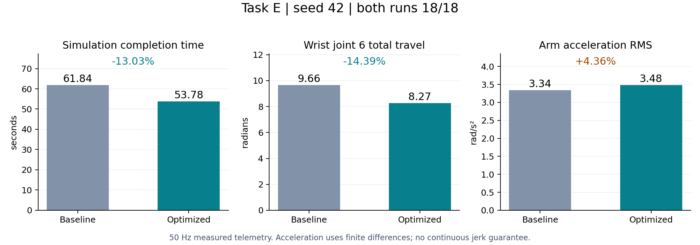
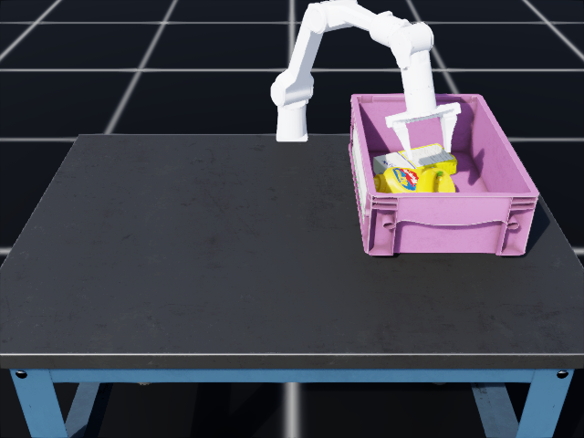

# 8.06 秒从哪里省下来

[仓库首页](../README.md) · [Task E 总览与运行](TASK_E.md) · [Task E 学习路线](LEARNING_GUIDE.md) · [跨任务学习路线](ATEC_PROJECTS.md)

seed 42 的仿真完成时间从 **61.84 秒降到 53.78 秒（−13.03%）**，两个版本都得到 18/18 分。腕关节总行程减少 **14.39%**。加速独立包在 seed 0 也达到 18/18，耗时 62.36 秒。下面以同一个 seed 42 初态为对照，拆开看时间花在哪里、动作又发生了什么变化。



## 先看那些已经完成、还在等待的动作

基线为接触和掉落稳定保留了固定等待。v3 在原状态机外加了一层反馈确认：满足最低等待和观测条件后，提前触发原来的确认逻辑；其余情况继续等待或执行原失败处理。

| 状态 | 原等待 | 最早检查时间 | 额外条件 |
| --- | ---: | ---: | --- |
| CLOSE | 70 步 / 1.40 s | 35 步 / 0.70 s | 最近 10 帧夹宽最大值减最小值小于 1.5 mm；原逻辑仍检查空抓 |
| VERIFY_LIFT | 30 步 / 0.60 s | 10 步 / 0.20 s | 夹宽 > 6 mm，且公开分数已确认抓起 |
| OPEN | 70 步 / 1.40 s | 20 步 / 0.40 s | 实测夹宽 > 65 mm |
| VERIFY_PLACE | 35 步 / 0.70 s | 10 步 / 0.20 s | 公开得分达到本次尝试所需增量，区分已抓取过的物体 |

闭爪稳定使用整个窗口的极差，避免振荡轨迹恰好首尾相同而误判稳定。每次切换状态清空窗口；分数下降表示重置时，交给原控制器重置。包装层只调整等待计数，不写入得分、完成标志或物理状态。

在实际 seed 42 运行中，这四类确认阶段合计 **10.20→3.90 秒**，节省 6.30 秒。最后一个物体进入篮区后环境会立即终止，因此实际执行次数并非每阶段都等于三次。

## 糖盒回撤时，为什么手腕多转了一圈

基线的糖盒回撤目标位置虽然接近，通用 IK 却可能选择不同的腕部解。规划第一段的腕目标从约 +1.87 rad 变到 −0.71 rad，造成多余转动。执行器每步收到的位置目标差已经有限制，但目标本身绕了路，走得慢也不会让这段路消失。

v3 将已有的连续姿态规划用于糖盒放置确认后的空夹回撤：从实测关节姿态出发，对接触位置和旋转插值，使用上一点作为 IK 初值，并检查整条路径。规划失败则退回原路径方法。

| 糖盒阶段 | 基线时间 | 加速版时间 | 基线腕行程 | 加速版腕行程 |
| --- | ---: | ---: | ---: | ---: |
| 回撤 RETRACT | 3.92 s | 1.00 s | 2.59830 rad | 0.00049 rad |
| 回观察位 HOME | 1.36 s | 2.70 s | 0.65631 rad | 1.87123 rad |
| **合计** | **5.28 s** | **3.70 s** | **3.25461 rad** | **1.87172 rad** |

改完回撤后，手腕仍然需要回到观察姿态，所以一部分转动延后到了 HOME。从表中可以看到，回撤快了，HOME 却变长了。两段合起来，时间减少 1.58 秒，腕行程减少 42.49%，臂关节差分加速度 RMS 减少 10.95%。

确认阶段节省 6.30 秒，加上这两段净省 1.58 秒，以及香蕉入篮终止时刻提前 0.18 秒，合计为 8.06 秒。最后的 0.18 秒来自终止事件，不是另一个独立控制改动。

## 全程指标与取舍

| 指标 | 基线 | v3 | 变化 |
| --- | ---: | ---: | ---: |
| 官方任务得分 | 18/18 | 18/18 | 保持 |
| 仿真完成时间 | 61.84 s | 53.78 s | −13.03% |
| 六个臂关节总行程 | 44.47216 rad | 42.56863 rad | −4.28% |
| 腕关节 6 总行程 | 9.65516 rad | 8.26540 rad | −14.39% |
| 臂关节绝对速度峰值 | 1.00922 rad/s | 0.93688 rad/s | −7.17% |
| 逐帧最大臂关节速度 P95 | 0.75989 rad/s | 0.79873 rad/s | +5.11% |
| 全程臂关节差分加速度 RMS | 3.33555 rad/s² | 3.48109 rad/s² | +4.36% |
| 仅运动阶段臂关节差分加速度 RMS | 3.75252 rad/s² | 3.71889 rad/s² | −0.90% |

回撤少了绕腕，全程关节行程和峰速也下降了，但 RMS 加速度没有全面下降。原因之一是静止等待减少：低运动量样本被移除后，全程平均的分母也变了。因此另列出七个运动阶段的统计，即 PREGRASP、DESCEND、LIFT、TRANSPORT、PLACE、RETRACT 和 HOME；这个分组不包含 INIT 和确认等待阶段。

这些指标回答的是具体的运动变化。连续时间加速度、加速度变化率（jerk）和接触力约束，还需要相应的轨迹设计与测量。

## 表里的运动指标怎样算

先看腕关节行程。把每相邻两帧的腕角变化取绝对值，再相加：

```math
L_6=\sum_{k=1}^{N-1}|q_{k,6}-q_{k-1,6}|.
```

这里 $`N`$ 是记录的帧数，关节编号 6 指最后一个臂关节，在 Python 中对应下标 5。例如手腕从 0 转到 1 rad，再回到 0，最终角度没变，行程却是 2 rad。所以它能发现“绕了一圈又回来”造成的冗余。

速度使用仿真实际返回的关节速度 $`v`$，不从动作目标推算。每帧取六个臂关节绝对速度的最大值，再对整段序列取第 95 百分位，就是表中的速度 P95。它与全程只出现一次的峰值描述的是不同事情。

差分加速度根据相邻帧的速度变化计算，控制步长为 0.02 秒：

```math
\alpha_{k,j}=\frac{v_{k,j}-v_{k-1,j}}{0.02}.
```

RMS 是先平方、求平均，再开方：

```math
A_{\mathrm{RMS}}=\sqrt{\mathrm{mean}(\alpha_{k,j}^2)}.
```

全程指标对所有有效时间间隔和六个臂关节一起取平均；分阶段指标保留同一计算方式，只选对应时间间隔。它衡量整体加速度量级，不等于最大的瞬时冲击。

所有指标由 50 Hz 的实际关节位置和速度计算，排除两个直线夹爪关节。先对连续数据作差分，再按状态归组，避免把相隔很远的同名状态连成虚假的跳变。终止样本未发生默认姿态重置，本次对比保留末帧。首次动作前没有位置样本，其位移未计入。

基线遥测运行没有录像，而候选运行包含录像，墙钟时间受编码负载影响，两次运行不适合直接比较程序计算速度。这里的 13.03% 由控制步数换算的仿真时间得到。

## 代码、视频与数据对应关系

- 基线：`baseline-18` 标签，当前 [solution_baseline.py](../solution_baseline.py) 保留原入口字节；五个底层依赖不变。
- v3 录像：seed 42 的源版本，2689 步、18 分。打包仅规范化新入口与基线入口的导入路径，详见 [源版本哈希与打包映射](../results/fast_seed42_source.json)。
- v3 独立包：seed 0 为 3118 步、18 分；seed 42 经公开启动器复核为 2689 步、18 分。七个运行文件与发布文件逐字节一致，见 [seed 0](../results/fast_seed0_package.json) 与 [seed 42](../results/fast_seed42_package.json)。
- 原始对比：[baseline42_motion](../results/baseline42_motion)、[fast42_motion](../results/fast42_motion)、[详细报告](../results/motion_comparison/comparison.md)、[分段归因](../results/motion_comparison/analysis.md)。公开遥测包含关节、动作、得分和阶段，不包含物体真值。

彩色视频只处理饱和度、对比度和编码兼容性，保留原始时间顺序和 1 倍仿真速度，结尾定格 2 秒；55.84 秒文件时长不等于 53.78 秒计分完成时间。原始录像和 SHA256 见 [来源记录](../media/provenance.json)。

## 官方终止与额外松爪观察

官方环境依据物体根位置进入篮区计分。第三件物体可能仍被夹住，累计分数就达到 18 并触发终止。正式录像在此结束，最后一帧可能仍看到夹爪夹住物体。为了进一步检查释放后的情况，又增加了独立诊断。

评测器另提供默认关闭的 `--post_terminal_release_steps 150`：先保存正式结果、计时、遥测和录像，再保持六个臂关节目标，逐步张开夹爪，额外观察 3 秒。额外动作由诊断工具执行，不是参赛策略继续运行；其奖励和时间不进入正式成绩。报告单独给出夹爪开度、最终篮区判定和最后一秒持续留篮情况。

seed 42 的额外诊断已完成：150 步 / 3 秒，夹宽从 57.88 mm 增至 70.00 mm；最终三个物体都在篮区，最后 1 秒内每个采样时刻也都在篮区。臂关节相对冻结目标的最大漂移约 0.00122 rad。这回答了本次开夹后是否留篮的问题。诊断只观察了这段时间，并没有测量接触力或更长时间的稳定性。

[释放诊断 JSON](../results/fast42_release/post_terminal_release.json) · [逐步诊断数据](../results/fast42_release/post_terminal_release.npz)



## 复现对比

需要 NumPy；生成图表另需 Matplotlib。先按仓库 README 配好仿真环境，再运行完整物理评测。

```bash
python3 tools/task_e/compare_motion.py \
  results/baseline42_motion results/fast42_motion \
  --relative-to . --output-dir runs/comparison

python3 tools/task_e/plot_comparison.py \
  runs/comparison/comparison.json --output runs/optimization.png

bash scripts/evaluate.sh --solution solution.py --headless --seed 42 \
  --max_steps 6000 --output runs/seed42_release \
  --post_terminal_release_steps 150
```

运动学和反馈门限的单元测试负责检查实现，物理评测负责观察接触与抓放结果。接下来应固定同一版本的一组种子，记录每次得分和失败阶段，再决定还可以从哪段搬运中节省时间。
