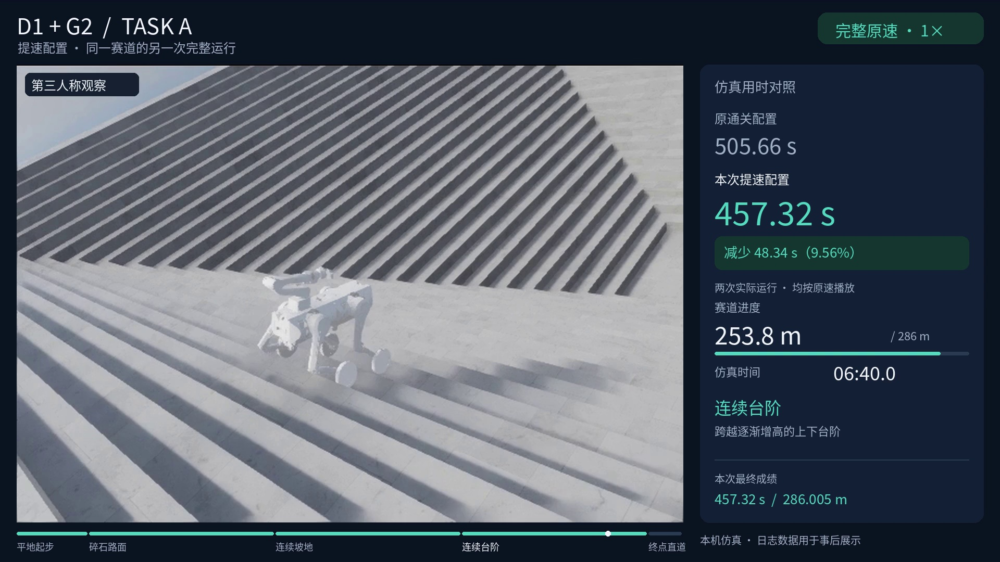

# 视频对比：所有旧版保留

[返回首页](../README.md) · [Task A 速度实测](../task_a/docs/SPEED_COMPARISON.md) · [Task E 原满分版本](TASK_E.md)

新视频使用独立文件名；已有视频、历史 Release 和原始实验记录均保留。**视频倍速不等于机器人控制提速**，下表分别写明。

## Task A：先看这几段

| 视频 | 实际任务成绩 | 展示方式 | 获取位置 |
| --- | --- | --- | --- |
| 原始完整通关 | 505.66 仿真秒 / 286.002 m | 640×480，原始录制 | [既有发布](https://github.com/LYHrmer/atec-robotics-projects/releases/tag/task-a-local-pass-20260909)，文件 `d1g2_taska_full_run.mp4` |
| 原通关横屏版 | 同一次 505.66 秒运行 | 1920×1080，完整 1×；第三人称 + 同次前视相机 | [对比发布](https://github.com/LYHrmer/atec-robotics-projects/releases/tag/robotics-comparison-20260910)，文件 `d1g2_taska_landscape_1080p_1x.mp4` |
| 原通关快速浏览 | 同一次 505.66 秒运行 | 明确标注 **10×**；约 52.57 秒，包含结果页 | 同上，文件 `d1g2_taska_landscape_preview_10x.mp4` |
| 新提速完整原片 | **457.32 仿真秒 / 286.005 m** | 新运行原始录制，0.70/0.50 m/s 指令 | 同上，文件 `d1g2_taska_faster_full_run.mp4` |
| 新提速横屏版 | 同一次 457.32 秒运行 | 1920×1080，完整 1×；第三人称 + 新旧成绩卡 | 同上，文件 `d1g2_taska_faster_landscape_1080p_1x.mp4` |
| 缺场景资源的首轮配置失败 | 69.90 仿真秒后停滞，未通关 | 原始录制，仅用于说明复现问题 | 同上，文件 `d1g2_taska_scene_assets_missing_01.mp4` |

横屏版末尾另加 2 秒结果页，所以文件时长分别为 507.7 / 459.3 秒；任务成绩取自原始 `result.json`，不是媒体时长。新提速运行没有保存前视视频，因此其横屏版只使用本次第三人称画面，没有拼入旧运行的相机。

原录像里的绿色标记遮挡、画质与机器人动作均保留；展示版只裁去旧小字信息栏、按比例排版并重绘说明，没有生成或替换机器人动作。导出脚本、来源与时间轴说明见 [视频制作说明](../tools/task_a_video/README.md)。

## Task A：完整历史过程

[12 段旧实验录像归档](https://github.com/LYHrmer/atec-robotics-projects/releases/tag/task-a-experiment-history-20260909) 收录原 2026-09-09 实验目录中的全部 `run.mp4`，包括多个 1399 / 1999 检查点失败、最后台阶局部诊断、原视觉停滞，以及最终完整通关。

附件按运行编号命名，发布页逐段注明结束原因；[本仓库清单](../media/task_a_historical_video_manifest.json) 和发布附件 `video_manifest.json` 提供大小与 SHA-256。局部诊断通过、中断录像和完整赛道通关分别列出，不混为成功案例。

## Task E

原几何/状态机方案视频继续保存在 [fast-smooth-18](https://github.com/LYHrmer/atec-robotics-projects/releases/tag/fast-smooth-18) 和 [baseline-18](https://github.com/LYHrmer/atec-robotics-projects/releases/tag/baseline-18)。新版模仿学习实验使用独立结果目录和文件名，完成闭环评测后再附实际成绩，不覆盖原 18/18 方案。
